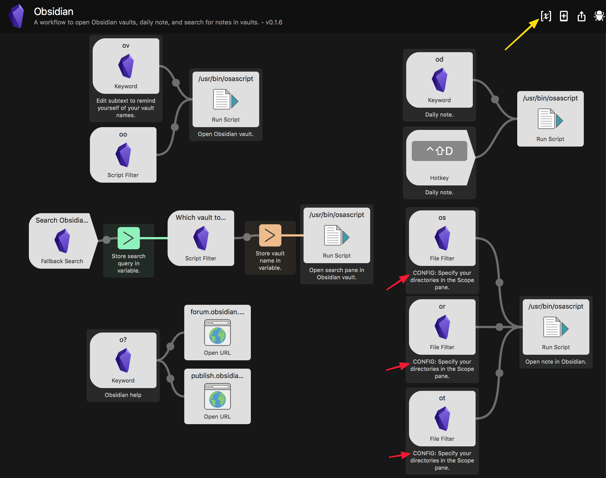
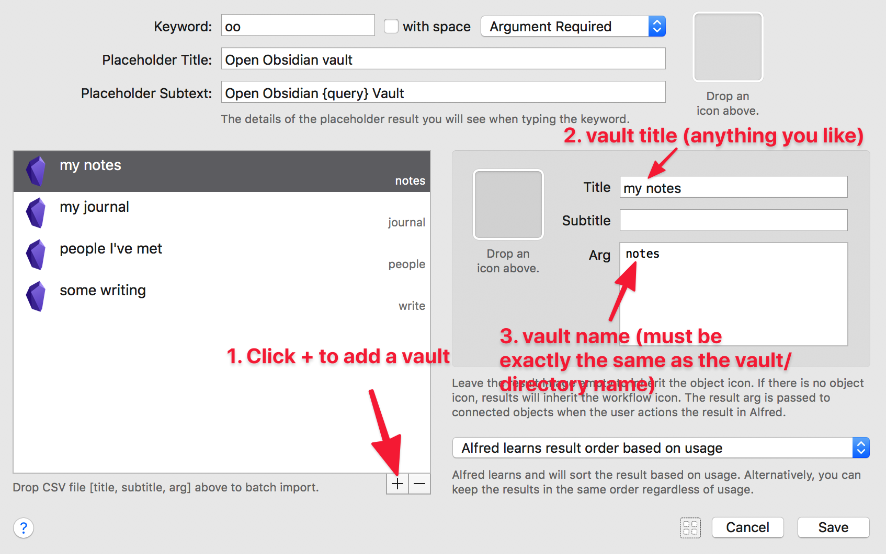
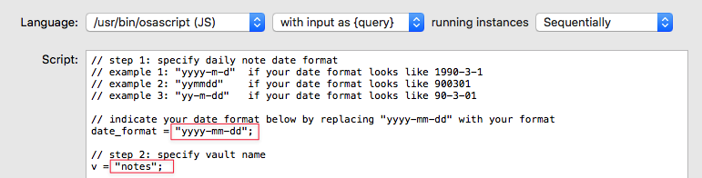
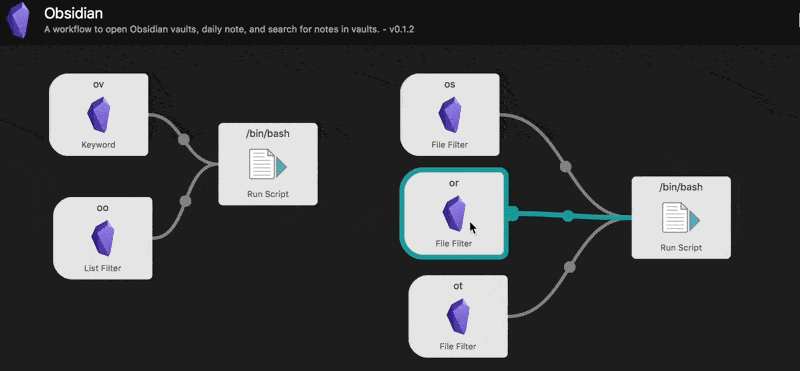
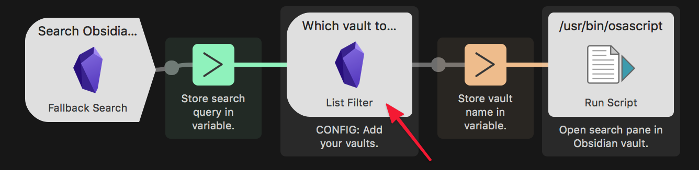

# What is Obsidian?

[Obsidian](https://obsidian.md/) is really cool and free note-taking app that wants to be your second brain. To learn more about it, check out my [Obsidian overview](https://medium.com/swlh/take-better-notes-with-this-free-note-taking-app-that-wants-to-be-your-second-brain-1a97909a677b) and [how I use it to take notes](https://medium.com/swlh/how-to-take-notes-insights-from-ai-neuroscience-a-sociologist-and-a-free-app-34b4be63080a) (and [why we take notes](https://medium.com/swlh/why-take-notes-3-common-misconceptions-and-3-better-mindsets-447ef6853aa9)).

# Alfred workflow for Obsidian

This simple [Alfred](https://www.alfredapp.com/) workflow uses [Obsidian](https://obsidian.md/)'s [URI scheme](https://publish.obsidian.md/help/Advanced+use/Using+obsidian+URI) (available in version 0.8.15 and above) and JXA actions/scripts (thanks to [@hjklapp](https://github.com/hjklapp)) to open notes in their vaults. This workflow has been tested in Obsidian 0.9.7.

Available Alfred features/keywords (contributors in parentheses)
- Open a vault: `ov`,`oo` ([@hjklapp](https://github.com/hjklapp))
- Search in vault(s): `os`, `or`, `ot`
- Open a daily note in a vault: `od` ([@technicalpickles](https://github.com/technicalpickles), [@luckman212](https://github.com/luckman212))
- Fallback search when there are no results ([@technicalpickles](https://github.com/technicalpickles))

# Installation

Download the [Obsidian.alfredworkflow](https://github.com/hauselin/obsidian-alfred/raw/master/Obsidian.alfredworkflow). Only tested in Alfred 4.

## Features that work out-of-the-box

### Open a vault: `ov`

To open one of your many Obsidian vaults, type `ov your_vault_name`. You can change the keyword input subtext to remind yourself of the names of your vaults. Double-click **ov Keyword** to change the Subtext field.

## Features that require some simple setting up

If you see **CONFIG** anywhere in the workflow, it means you need to modify that part of the workflow slightly to set things up.

### Open a vault with autocomplete: `oo`

To autofill and autocomplete Obsidian vaults: Type `oo your_vault_name`. 
- Double-click **oo List Filter** to add all your vaults. See screenshots below.
- This feature is suggested by [@hjklapp](https://github.com/hjklapp).

### Open daily note: `od`

- The Daily notes Obsidian plugin must be enabled.
- Notes and comments are provided in the workflow/script to help you set things up. Double-click the **/usr/bin/osascript Run Script** associated with **od Keyword** to set it up. You need to specify your daily note date format (step 1 in script) and the vault name (step 2 in script). Click Save when you're done.
    - New in v0.1.3: Specify your date format in the /usr/bin/osacript by using yyyy, mm, dd. See screenshot below (steps 1 and 2).
    - New in v0.1.5: Create a new daily note if it doesn't exist yet (see step 3, OPTIONAL step). Specify the absolute path to the directory (`fulldir_daily`) containing your daily notes; specify the template path (if you have a template) for your daily note (`fullpath_template`). If you don't specify these paths properly, Obsidian won't find your daily note and won't create it if the note doesn't exist yet.
      - This feature addresses this [issue](https://github.com/hauselin/obsidian-alfred/issues/6), where you get the "File not found message." if your daily note doesn't exist.

### Search Obsidian vaults with Alfred File Filters; `os`, `or`, `ot`

You'll have to edit the Scope of each File Filter to tell Alfred where to search for files on your computer. Double-click **os File Filter**, **or File Filter**, and **ot File Filter**. You can also change other settings via Basic Setup, Scope, Fields, Limit and Sort tabs.

- Search for all files with the term `xyz`, type `os xyz`.
- Search for recent files (last 3 days) with the term `xyz`, type `or xyz`.
- Search for files modified today, `xyz`, type `ot xyz`.

### Alfred fallback search

New in v0.1.5. Alfred supports [fallback searches](https://www.alfredapp.com/help/features/default-results/fallback-searches/) (i.e., "Fallback searches are the list of search options you see when you search for a keyword that doesn't match a result on your local Mac."; see screenshot below). 

When a fallback search is invoked, the workflow will ask which vault you want to search in. To set it up, follow these steps: 

- Specify the vaults Alfred will suggest (as with the `oo` list filter).

- Go to Alfred's Features pane, click Setup fallback results, click the + icon, add a Workflow Trigger, add Search Obsidian for {query}, reorder the fallback searches however you like, and click Save.

  

  

## Known bugs

If the Obsidian app isn't already opened, this workflow will always open the last recently opened vault. This bug is a known issue with Electron apps on MacOS. See [discussion on Obsidian's Discord](https://discordapp.com/channels/686053708261228577/716028884885307432/755203478413902036).

## Contributors

Alphabetical order

- [@hjklapp](https://github.com/hjklapp)
- [@ldebritto](https://github.com/ldebritto)
- [@luckman212](https://github.com/luckman212)
- [@technicalpickles](https://github.com/technicalpickles)

