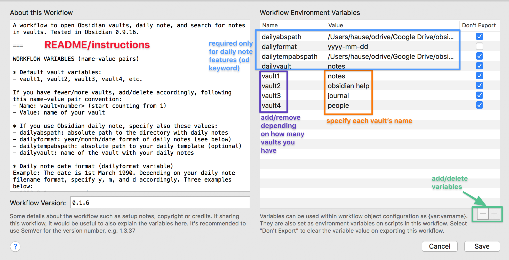

# What is Obsidian?

[Obsidian](https://obsidian.md/) is really cool and free note-taking app that wants to be your second brain. To learn more about it, check out my [Obsidian overview](https://medium.com/swlh/take-better-notes-with-this-free-note-taking-app-that-wants-to-be-your-second-brain-1a97909a677b) and [how I use it to take notes](https://medium.com/swlh/how-to-take-notes-insights-from-ai-neuroscience-a-sociologist-and-a-free-app-34b4be63080a) (and [why we take notes](https://medium.com/swlh/why-take-notes-3-common-misconceptions-and-3-better-mindsets-447ef6853aa9)).

# Alfred workflow for Obsidian

This simple [Alfred](https://www.alfredapp.com/) workflow uses [Obsidian](https://obsidian.md/)'s [URI scheme](https://publish.obsidian.md/help/Advanced+use/Using+obsidian+URI) (available in version 0.8.15 and above) and JXA actions/scripts (thanks to [@hjklapp](https://github.com/hjklapp)) to open notes in their vaults. This workflow has been tested in Obsidian 0.9.16.

Available Alfred features/keywords (contributors in parentheses)
- Open a vault: `ov`,`oo` ([@hjklapp](https://github.com/hjklapp))
- Search in vault(s): `os`, `or`, `ot`
- Open a daily note in a vault: `od` ([@technicalpickles](https://github.com/technicalpickles), [@luckman212](https://github.com/luckman212))
- Fallback search when there are no results ([@technicalpickles](https://github.com/technicalpickles))
- Get help by opening [help vault](https://publish.obsidian.md/help/Index) and [forum](https://forum.obsidian.md/): `o?` 

## Installation

Download the [Obsidian.alfredworkflow](https://github.com/hauselin/obsidian-alfred/raw/master/Obsidian.alfredworkflow) file. Add to Alfred and enjoy the workflow! Only tested in Alfred 4.

## Features that work out-of-the-box

### Open a vault: `ov`

To open one of your many Obsidian vaults, type `ov your_vault_name`. If you vault name is `my notes`, you type `ov my notes`. You can change the keyword input subtext to remind yourself of the names of your vaults. Double-click **ov Keyword** to change the Subtext field.

## Features that require some basic setting up

After installing the workflow, click the `[x]` icon at the top right (yellow arrow below). Also, if you see **CONFIG** (red arrows) anywhere in the workflow, it means you need to modify that part of the workflow (more instructions below).

After clicking the `[x]` icon, you should see the pane below. The README section (left) tells you how to set up your workflow environment variables (right). 

- **Vaults**: If you have three vaults (e.g., vault names are *notes*, *secrets*, *jokes*), you should have three vault variables named `vault1`, `vault2`, `vault3`, with values *notes*, *secrets*, *jokes*. 
- **Daily note** (`od` keyword): See README for full documentation of the four variables `dailyabspath`, `dailyformat`, `dailytempabspath`, `dailyvault`.

### Open a vault with autocomplete: `oo`

- To autofill and autocomplete Obsidian vaults (suggested by [@hjklapp](https://github.com/hjklapp)): `oo your_vault_name`
- Works only if you've set up your vault variables properly (as indicated above).

### Open daily note: `od`

- The Daily notes Obsidian plugin must be enabled.
- `od` will open your daily note, assuming you've set up your workflow environment variable correctly (instructions above). Alternatively, you can use a hotkey.
- Works only if you've set up your daily note variables properly (as indicated above).

### Search Obsidian vaults with Alfred File Filters; `os`, `or`, `ot`

You'll have to edit the Scope of each File Filter to tell Alfred where to search for files on your computer. Double-click **os File Filter**, **or File Filter**, and **ot File Filter**. You can also change other settings via Basic Setup, Scope, Fields, Limit and Sort tabs.

- Search for all files with the term `xyz`: `os xyz`
- Search for recent files (last 3 days) with the term `xyz`: `or xyz`
- Search for files modified today, `xyz`: `ot xyz`

### Alfred fallback search

New in v0.1.5. Supports Alfred [fallback searches](https://www.alfredapp.com/help/features/default-results/fallback-searches/) (i.e., "Fallback searches are the list of search options you see when you search for a keyword that doesn't match a result on your local Mac."; see screenshot below). Thanks [@technicalpickles](https://github.com/technicalpickles) for suggesting this feature.

- Works only if you've set up your vault variables properly (as indicated above).

When a fallback search is invoked, the workflow will ask which vault you want to search in. To set it up, follow these steps: 

- Go to Alfred's Features pane, click **Setup fallback results**, click the **+** icon, add a **Workflow Trigger**, add **Search Obsidian for {query}**, reorder the fallback searches however you like, and click **Save**.

## Known bugs

If the Obsidian app isn't already opened, this workflow will always open the last recently opened vault. This bug is a known issue with Electron apps on MacOS. See [discussion on Obsidian's Discord](https://discordapp.com/channels/686053708261228577/716028884885307432/755203478413902036).

## Contributors

Alphabetical order

- [@hjklapp](https://github.com/hjklapp)
- [@ldebritto](https://github.com/ldebritto)
- [@luckman212](https://github.com/luckman212)
- [@technicalpickles](https://github.com/technicalpickles)

