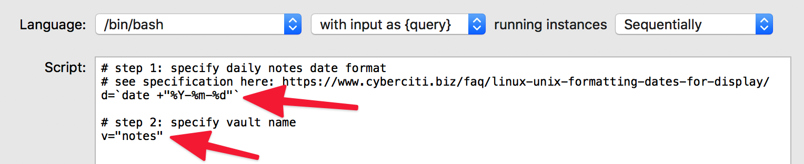

# Alfred workflow for Obsidian

This very simple [Alfred](https://www.alfredapp.com/) workflow uses [Obsidian](https://obsidian.md/)'s [URI scheme](https://publish.obsidian.md/help/Advanced+use/Using+obsidian+URI) (available in version 0.8.15 and above) and bash scripts to open notes in their vaults.

This workflow has been tested in Obsidian 0.9.6.

## Features that work out-of-the-box

### Open a vault: `ov`

To open one of your many Obsidian vaults, type `ov your_vault_name`. You can change the keyword input subtext to remind yourself of the names of your vaults. Double-click **ov Keyword** to change the Subtext field.

## Features that require some (simple) setting up

### Open a vault with autocomplete: `oo`

To autofill and autocomplete Obsidian vaults: Type `oo your_vault_name`. 
- Double-click **oo List Filter** to add all your vaults. See screenshots below.
- This feature is suggested by @hjklapp.

### Open daily note: `od`

- The Daily notes Obsidian plugin must be enabled.
- Type `od`  or use a hotkey (double-click the empty Hotkey to set it up). 
- Notes and comments are provided in the workflow/script to help you set things up. Double-click the **/bin/bash Run Script** associated with **od Keyword** to set it up. You need to specify your daily note date format (step 1 in script) and the vault name (step 2 in script). Click Save when you're done.

### Search Obsidian vaults with Alfred File Filters; `os`, `or`, `ot`

You'll have to edit the Scope of each File Filter to tell Alfred where to search for files on your computer. Double-click **os File Filter**, **or File Filter**, and **ot File Filter**. You can also change other settings via Basic Setup, Scope, Fields, Limit and Sort tabs.

- Search for all files with the term `xyz`, type `os xyz`.
- Search for recent files (last 3 days) with the term `xyz`, type `or xyz`.
- Search for files modified today, `xyz`, type `ot xyz`.

**Other features**

If you want to copy the path to a file instead of opening it in Obsidian, check out @ldebritto's [fork](https://github.com/ldebritto/obsidian-alfred). 

## Known bugs

If the Obsidian app isn't already opened, this workflow will always open the last recently opened vault. This bug is a known issue with Electron apps on MacOS. See [discussion on Obsidian's Discord](https://discordapp.com/channels/686053708261228577/716028884885307432/755203478413902036).

This workflow might not work well with filenames containing accented characters like ã, é, ï, ô, ú (thanks @ldebritto for spotting this). 