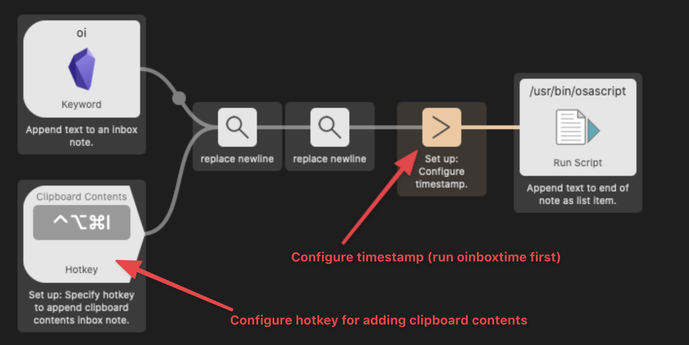

# What is Obsidian?

[Obsidian](https://obsidian.md/) is really cool and free note-taking app that wants to be your second brain. To learn more about it, check out my [Obsidian overview](https://medium.com/swlh/take-better-notes-with-this-free-note-taking-app-that-wants-to-be-your-second-brain-1a97909a677b) and [how I use it to take notes](https://medium.com/swlh/how-to-take-notes-insights-from-ai-neuroscience-a-sociologist-and-a-free-app-34b4be63080a) (and [why we take notes](https://medium.com/swlh/why-take-notes-3-common-misconceptions-and-3-better-mindsets-447ef6853aa9)).

# Alfred workflow for Obsidian

This simple [Alfred](https://www.alfredapp.com/) workflow uses [Obsidian](https://obsidian.md/)'s [URI scheme](https://publish.obsidian.md/help/Advanced+topics/Using+obsidian+URI) and JXA actions/scripts (thanks to [@hjklapp](https://github.com/hjklapp)) to open notes in their vaults. This workflow has been tested in Obsidian 0.11.9. See also [known issues](#known-issues).

Available Alfred features/keywords (contributors in parentheses)
- Open a vault: `ov`,`oo` ([@hjklapp](https://github.com/hjklapp))
- Search for *all* markdown files on your computer: `os`, `or`, `ot`
- Search for markdown files inside your vaults: `oss`, `orr`, `ott`
  - You can also customize your Hotkeys instead. 
- Create a new empty note and open in selected vault: `on`
- Open a daily note in a vault: `od` ([@technicalpickles](https://github.com/technicalpickles), [@luckman212](https://github.com/luckman212))
  - You can also customize your Hotkey to open your daily note.
- Create or open tomorrow's daily note: `otmr`
- Adding text to an inbox note: `oi` ([@LouisInFlow](https://github.com/LouisInFlow))
  - You can also customize your Hotkey to directly append clipboard contents to the inbox note.
  - Open inbox note with `oii` or customize your Hotkey to open inbox note.
  - Turn on/off notifications when adding text to inbox note with `onotify`
- Fallback search when there are no results ([@technicalpickles](https://github.com/technicalpickles))
- Open terminal in vault directory: `oterm`
- Get help by opening [help vault](https://publish.obsidian.md/help/Index) and [forum](https://forum.obsidian.md/): `o?` 

## Installation

Download the [latest release](https://github.com/hauselin/obsidian-alfred/raw/master/Obsidian.alfredworkflow) and add the workflow to Alfred. Only tested in Alfred 4.

## Features that require no set-up

### Open a vault: `ov`

To open one of your many Obsidian vaults, type `ov your_vault_name`. If you vault name is `my notes`, you type `ov my notes`. You can change the keyword input subtext to remind yourself of the names of your vaults. Double-click **ov Keyword** to change the Subtext field.

All other features require a one-time set-up (v0.2.0 onward).

## Set up

**This version (≥ v0.2.0) of the workflow requires a one-time set-up.** 

- Add your vaults, one at a time: `oaddvault`
  - Obsidian's help vault has been added by default.
- To clear all vaults other than Obsidian's help vault: `oclearvaults`
- To clear a single vault: `oclearvault`

**If you use Obsidian's Daily notes plugin, you'll also need to set it up.**

- Specify daily vault: `odailyvault`
- Specify daily note format: `odailyformat`
  - Example: The date is 1st March 1990. 
    - If your date format is `1990-3-1`, enter `yyyy-m-d`
    - If your date format is `900301`, enter `yymmdd`
    - If your date format is `1_3-90`, enter `d_m-yy`
    - If your date format is `1 March 1990`, enter `d MMMM yyyy`
    - If your date format is `Mar 01, 90`, enter `MM dd, yy`
- Specify daily note directory/path: `odailypath`
- Specify daily note template: `odailytemplate`
  - Required only if you have a template for daily notes.

**If you want to append text to an inbox note, you'll have to specify the note you're using as your inbox note.**

- Specify inbox note: `oinbox`
 
## Features available after set-up

### Open a vault with autocomplete: `oo`

- To autofill and autocomplete Obsidian vaults (suggested by [@hjklapp](https://github.com/hjklapp)): `oo your_vault_name`

### Open daily note: `od`

- The Daily notes Obsidian plugin must be enabled.
- `od` opens today's daily note. Alternatively, you can use a hotkey. If you've successfully followed all the set-up steps, `od` will also create today's daily note if it doesn't exist yet. If you see error messages, most likely you haven't set things up properly. Follow the set-up instructions carefully and try again.

### Create or open tomorrow's daily note: `otmr`

Works the same way as `od`, but for tomorrow's daily note. Great for planning your next day.

### Search for markdown files: `os`, `or`, `ot` (or `oss`, `orr`, `ott`)

The keywords `os`, `or`, and `ot` will look for markdown files *everywhere* on your system (i.e., not just your vaults). If a file isn't in any of your Obsidian vaults, the file will open in your default editor instead of Obsidian.

- Search for all markdown files with the term `xyz`: `os xyz`
- Search for recent files (last 3 days) with the term `xyz`: `or xyz`
- Search for files modified today with the term `xyz`: `ot xyz`

To look for markdown files that are only inside your vaults, use `oss`, `orr`, and `ott` instead. These three keywords require you to first press enter before you can perform your search. You can also customize your hotekeys to perform these searches.

**Common problem: No matching file found (see [issue #15](https://github.com/hauselin/obsidian-alfred/issues/15))**. If this problem happens to you, [try the solutions described here](https://github.com/hauselin/obsidian-alfred/issues/15#issuecomment-753414360).

### Create a new note: `on`

- `on` will ask you to select a vault. Then you'll enter the note name/title. The new note will open in the selected Obsidian vault.
- If you don't enter a note name, the default note name will look something like `20201121_151123`, which is generated using [Alfred's dynamic placeholders](https://www.alfredapp.com/help/workflows/advanced/placeholders/): `{date:yyyyMMdd_HHmmss}`. 

### Add text as list items (bullet points) to the end of a note

`oi` lets you append text to an end of a note. To use `oi`, you first have to specify which note you want to append to using `oinbox`. Then, `oi Hello world!` will append `- Hello world!` to the end of your inbox note. 

In addition, you can set up hotkey (see image below) to directly append the contents in your clipboard to the end of your inbox notes.

**BECAUSE THIS FEATURE MODIFIES YOUR NOTES, BACK UP YOUR VAULT AND NOTES!**

To open your inbox note in Obsidian, use `oii` or customize your hotkey.

### Alfred fallback search

Supports Alfred [fallback searches](https://www.alfredapp.com/help/features/default-results/fallback-searches/) (i.e., "Fallback searches are the list of search options you see when you search for a keyword that doesn't match a result on your local Mac."; see screenshot below). Thanks [@technicalpickles](https://github.com/technicalpickles) for suggesting this feature.

When a fallback search is invoked, the workflow will ask which vault you want to search in. To set it up, follow these steps: 

- Go to Alfred's **Features** pane, click **Default Results pane**, click **Setup fallback results** at the bottom, click the **+** icon, add a **Workflow Trigger**, add **Search Obsidian for {query}**, reorder the fallback searches however you prefer, and click **Save**.

## Known issues

If the Obsidian app isn't already opened, this workflow will always open the last recently opened vault. This bug is a known issue with Electron apps on MacOS. See [discussion on Obsidian's Discord](https://discordapp.com/channels/686053708261228577/716028884885307432/755203478413902036). To overcome this limitation (see #23), many commands in this workflow (v0.3.0 onward) try to open a note twice (the second attempt happens 3 seconds after the first attempt), so you'll see two Obsidian notifications. 

## Contributors

Alphabetical order

- [@hjklapp](https://github.com/hjklapp)
- [@jamiew](https://github.com/jamiew)
- [@lastobelus](https://github.com/lastobelus)
- [@ldebritto](https://github.com/ldebritto)
- [@luckman212](https://github.com/luckman212)
- [@LouisInFlow](https://github.com/LouisInFlow)
- [@technicalpickles](https://github.com/technicalpickles)

